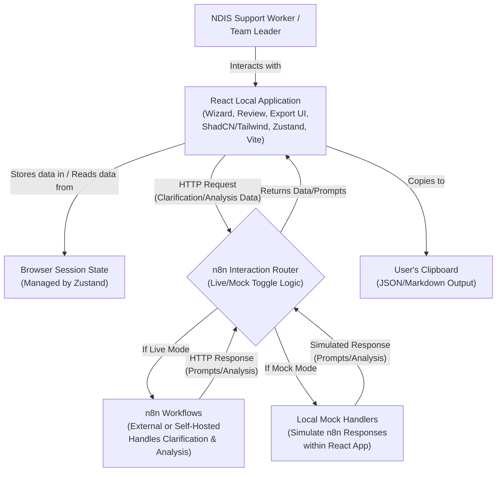
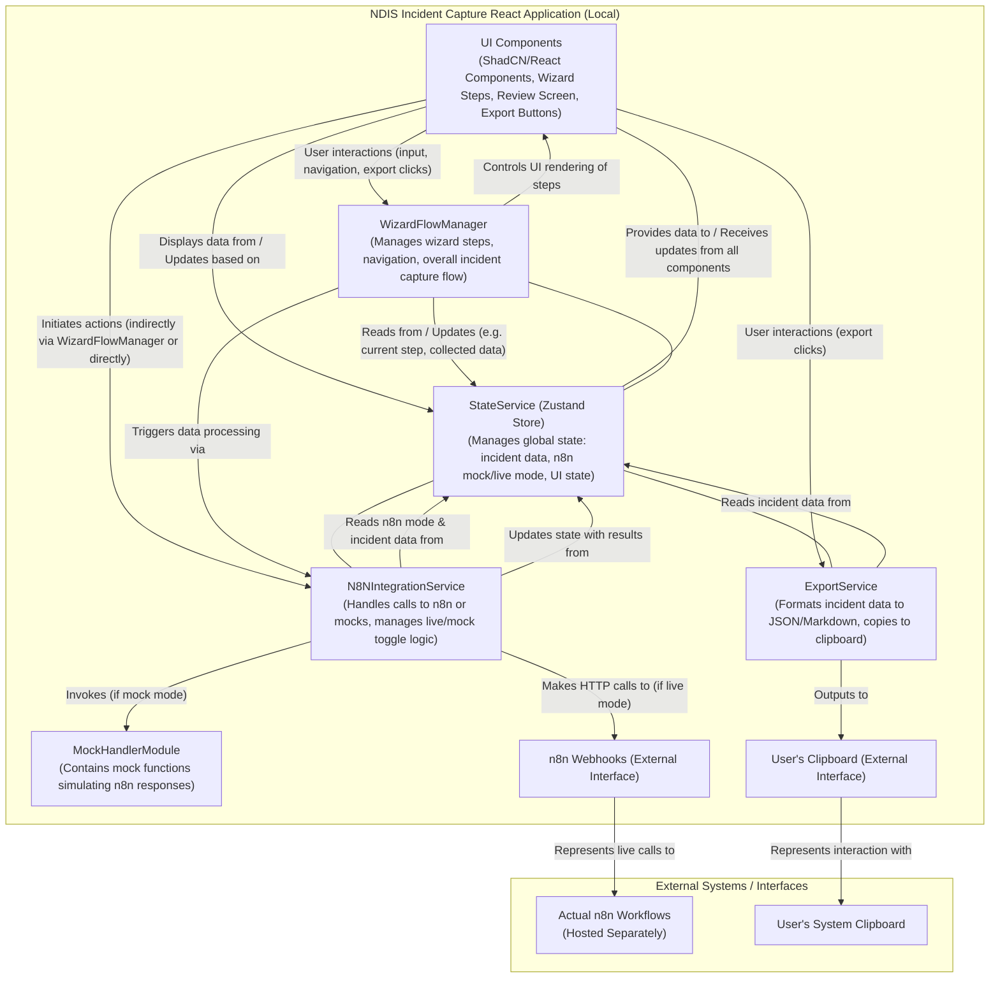

# NDIS Incident Capture / Analysis Tool Architecture Document

## 1. Technical Summary

The NDIS Incident Capture / Analysis Tool is a local, client-side React application designed for the rapid capture and initial analysis of NDIS incidents. Built using Vite, React, ShadCN/UI, Tailwind CSS, and Zustand for state management, it features a step-by-step wizard interface to guide users through incident reporting. Backend-style logic, including data enrichment through clarification prompts and basic incident analysis (e.g., contributing factors, classification), is handled by n8n workflows accessed via webhook calls. A key feature is the ability to toggle between live n8n webhooks and local mock handlers for standalone frontend development and demonstration. All incident data is managed within the browser's session state for the MVP and can be exported to JSON or Markdown formats directly to the user's clipboard. The architecture prioritizes speed of development and local functionality, aligning with the project's MVP goals to improve the timeliness and accuracy of NDIS incident reporting through a simple, guided process.

## 2. High-Level Overview

The architectural style is a **Client-Side Single Page Application (SPA)** with **Externalized Logic** facilitated by n8n webhooks. The entire application runs locally in the user's browser.

The primary user interaction and data flow are as follows:

1.  A **Support Worker** (or **Team Leader**) initiates incident capture using the React application's wizard interface.
2.  The application collects initial incident details step-by-step, storing them in the session state (managed by Zustand).
3.  At predefined points, the React application makes an HTTP request to an **n8n Interaction Router** component within the application. This router, based on a toggleable mode, either:
    - Forwards the request to an actual **n8n Clarification Webhook** with the current incident data.
    - Directs the call to a **Local Mock Handler** that simulates the n8n response.
4.  The n8n workflow (or mock handler) processes the data and responds, potentially with clarification questions to ask the user, or an indication that no clarification is needed.
5.  The React application displays any received clarification questions one at a time. The user's answers are captured and update the incident data in the session state.
6.  Once all primary data and clarifications are collected, the application sends the complete incident data via the n8n Interaction Router to an **n8n Analysis Webhook** (or its corresponding mock handler).
7.  The n8n workflow (or mock handler) returns a basic analysis, such as suggested contributing factors and incident classification. This analysis is added to the incident data in the session state.
8.  The user can then access a **Review Screen** to see all captured details and the n8n-generated analysis for incidents from the current session.
9.  Finally, the user can **export** the complete incident report (including analysis) to their clipboard in either JSON or Markdown format.



## 3. Component View

The NDIS Incident Capture / Analysis Tool, while a client-side application, can be broken down into several key logical components that work together to deliver its functionality.



**Component Descriptions:**

- **`UI Components (ShadCN/React)`**:
  - **Responsibilities:** Render the entire user interface, including the multi-step wizard, input fields (text inputs, date pickers, textareas using ShadCN components), the incident review screen, and action buttons (Next, Previous, Export to JSON, Export to Markdown, n8n mode toggle if UI-based).
  - **Collaboration:** These components capture user input and display data retrieved from the `StateService`. They trigger actions in the `WizardFlowManager` (for navigation), `N8NIntegrationService` (for initiating clarification/analysis calls, often via the `WizardFlowManager`), and `ExportService` (for data export).
- **`WizardFlowManager`**:
  - **Responsibilities:** Orchestrates the incident capture process. Manages the current step within the wizard, handles navigation logic (e.g., "Next", "Previous" button actions), and determines which set of UI components (questions/fields) to display for the current step. It also gates progress based on input completion or n8n clarification steps.
  - **Collaboration:** Interacts heavily with the `StateService` to get and set the current incident data and wizard progress. It renders the appropriate `UI Components` for each step and triggers calls to the `N8NIntegrationService` at designated points in the flow (e.g., after a narrative section is completed, or for final analysis).
- **`StateService (Zustand Store)`**:
  - **Responsibilities:** Acts as the central store for all global application state. This includes the complete incident report object as it's being constructed (basic details, narratives, clarification Q&As, n8n-generated analysis), the current state of the n8n live/mock toggle, and any other shared UI state (e.g., loading indicators for n8n calls).
  - **Collaboration:** Provides data to, and accepts updates from, nearly all other components. `UI Components` subscribe to relevant parts of the store to display data. `WizardFlowManager`, `N8NIntegrationService`, and `ExportService` read from and write to this store.
- **`N8NIntegrationService`**:
  - **Responsibilities:** Manages all interactions with the n8n backend (or its mocks). It contains the logic to check the n8n live/mock mode status (from `StateService`). If in "live" mode, it constructs and sends HTTP requests (e.g., using `fetch` or a library like `axios`) to the configured n8n webhook URLs for clarification prompts and basic analysis. If in "mock" mode, it calls the appropriate functions within the `MockHandlerModule`. It processes responses (actual or mocked) and dispatches updates to the `StateService` with the received data (e.g., clarification questions, analysis results).
  - **Collaboration:** Triggered by the `WizardFlowManager` or specific `UI Components`. Reads configuration (like n8n mode and webhook URLs if dynamic) and incident data from `StateService`. Updates `StateService` with results. Invokes `MockHandlerModule` when necessary.
- **`MockHandlerModule`**:
  - **Responsibilities:** Provides a set of local JavaScript/TypeScript functions that simulate the behavior and responses of the n8n webhooks. Each mock function corresponds to an n8n endpoint (e.g., clarification for pre-event narrative, final analysis) and returns predefined or dynamically generated mock data (e.g., sample questions, mock analysis results) that mimics the structure of actual n8n responses. This is crucial for standalone frontend development and testing.
  - **Collaboration:** Invoked by `N8NIntegrationService` when the application is in "mock" mode. It does not interact directly with other services beyond returning data to `N8NIntegrationService`.
- **`ExportService`**:
  - **Responsibilities:** Handles the formatting and exporting of the complete incident report. It retrieves the final incident data (including n8n analysis) from the `StateService`. It then transforms this data into the required JSON structure (as defined in `docs/data-models.md`) or a human-readable Markdown format. Finally, it uses browser APIs to copy the generated string (JSON or Markdown) to the user's clipboard and provides user feedback on success/failure.
  - **Collaboration:** Triggered by user actions in `UI Components` (e.g., "Export to JSON" button). Reads data from `StateService`.

**External Systems/Interfaces (Conceptual for the React App):**

- **`n8n Workflows (External)`**: These are the actual n8n workflows, hosted separately (either self-hosted n8n or n8n.cloud). They receive webhook requests from the React app (when in live mode), execute their defined logic (prompt engineering, AI calls, data transformation), and return JSON responses. The React app treats these as black-box services accessible via HTTP.
- **`User's Clipboard (External)`**: The system clipboard provided by the user's operating system, which the browser can interact with (with permissions/user gesture) to copy text.

## 4. Key Architectural Decisions & Patterns

Several key architectural decisions and patterns have been adopted to meet the project's requirements, emphasizing rapid development, local operation, and ease of use for the MVP.

- **Decision 1: Client-Side Single Page Application (SPA) with Externalized Logic (n8n)**

  - **Description:** The application is a pure client-side SPA built with React. All backend-style logic, such as data enrichment and analysis, is delegated to n8n workflows accessed via webhooks.
  - **Justification:** This approach meets the primary requirement for a local application that can be run directly in the browser from static files. It simplifies deployment for the MVP and leverages n8n's strengths for workflow automation without requiring a dedicated backend server managed by the application itself. This supports rapid frontend development and iteration.

- **Decision 2: Local Session-Based Data Management (No Database for MVP)**

  - **Description:** All incident data captured during a user's session is stored locally within the browser's memory (managed by the Zustand state store). There is no persistent database storage in the MVP. Data is exported on demand.
  - **Justification:** This aligns with the MVP scope, which prioritizes "speed of development" and demonstration capabilities. It avoids the complexity of database setup, schema management, and backend data persistence logic for the initial version.

- **Decision 3: Vite for Scaffolding and Build Tooling**

  - **Description:** Vite is used as the build tool and development server for the React application.
  - **Justification:** Chosen for its extremely fast Hot Module Replacement (HMR), quick server start-up times, and efficient build process, all of which contribute to a better developer experience and faster iteration cycles, directly supporting the "speed of development" goal.

- **Decision 4: Zustand for Global State Management**

  - **Description:** Zustand is employed for managing global application state, such as the incident report object being constructed, n8n interaction mode (live/mock), and other shared UI states.
  - **Justification:** Zustand provides a minimalistic, hook-based API that is simple to use and integrate, aligning with rapid development goals. It's efficient for managing state across the multi-step wizard and other components, preventing prop-drilling and offering good performance with selective subscriptions.

- **Decision 5: UI Development with React, ShadCN/UI, and Tailwind CSS**

  - **Description:** The user interface is built using React, with ShadCN/UI for pre-built and customizable components, and Tailwind CSS for utility-first styling.
  - **Justification:** These technologies were specified in the project requirements. This combination allows for rapid development of a modern, consistent, and responsive UI. ShadCN/UI's approach of providing components as code that can be owned and modified offers flexibility.

- **Decision 6: Toggleable n8n Mocking Framework**

  - **Description:** The application includes a mechanism to switch between making live calls to n8n webhooks and using local mock handlers that simulate n8n responses.
  - **Justification:** This is a critical feature for enabling independent frontend development and testing, even when live n8n workflows are unavailable or under development. It ensures the UI and core application logic can be validated in isolation, which is essential for meeting the "done quickly" objective.

- **Decision 7: Wizard-Based User Interface for Incident Capture**

  - **Description:** Incident details are collected through a step-by-step wizard interface that presents questions and clarification prompts one at a time.
  - **Justification:** This pattern is mandated by the project requirements to guide non-technical users (Support Workers) through the reporting process in a clear, focused manner, and to simplify the handling of dynamic clarification prompts from n8n.

- **Decision 8: Direct to Clipboard Export (JSON & Markdown)**
  - **Description:** Completed incident reports (including n8n analysis) can be exported directly to the user's clipboard in both JSON and Markdown formats.
  - **Justification:** This meets the MVP data export requirements without needing complex file download mechanisms, server-side rendering for export formats, or reliance on browser/OS file system APIs beyond clipboard access. It provides a simple and effective way for users to extract the data.

## 5. Core User Workflows

The following diagram illustrates the primary workflows a user will follow when interacting with the NDIS Incident Capture / Analysis Tool, from initiating an incident report to exporting the final data.

```mermaid
flowchart TD
    subgraph "Phase 1: Incident Report Collection"
        direction LR
        A[Start New Incident Report] --> B(Step 1: Event Overview<br/>Input basic details: <br/>Reporter, Participant, Date/Time, Location);
        B --> C(Step 2: Capture Event Narratives<br/>Input for sections like: <br/>'What happened before?', 'During?', 'How it ended?', 'Support given?');
        C --> D{Clarification Needed?<br/>(App calls n8n clarification service)};
        D -- Yes --> E(Step 3: Event Clarification<br/>n8n provides question(s) one-by-one,<br/>User provides answers);
        E --> F(Narratives Updated with Clarifications);
        F --> G[Data Collection Complete];
        D -- No --> G;
    end

    subgraph "Phase 2: Narrative Analysis & Export"
        direction LR
        G_Copy[Data Collection Complete] --> H(Step 4: Automated Analysis Triggered<br/>All collected data sent to n8n analysis service);
        H --> I(n8n Returns Analysis:<br/>Contributing Factors, Incident Classification);
        I --> J(Step 5: Review Full Incident Report<br/>Display all details, narratives, clarifications, and n8n-generated analysis);
        J --> K(Step 6: Export Incident Report<br/>User chooses to export to JSON or Markdown to clipboard);
        K --> L[Process End];
    end
```

**Workflow Description:**

1.  **Phase 1: Incident Report Collection**

    - The user (Support Worker or Team Leader) starts a new incident report.
    - **Step 1 (Event Overview):** Basic details about the incident are entered (e.g., reporter name, participant name, event date/time, location).
    - **Step 2 (Capture Event Narratives):** The user provides detailed narrative descriptions for different phases of the event (e.g., what was occurring before, during, and how the event ended; support provided).
    - **Step 3 (Event Clarification - Conditional):** After submitting narrative sections, the application calls an n8n clarification service. If n8n determines more specific details are needed, it returns targeted questions one at a time, which are presented to the user. The user's answers are captured and appended to the relevant narrative or stored appropriately. This step is skipped if n8n indicates no clarification is needed for a given section.
    - This phase concludes when all required information and any necessary clarifications have been provided.

2.  **Phase 2: Narrative Analysis & Export**
    - **Step 4 (Automated Analysis Triggered):** Once data collection is complete, the application sends the full incident data (including all narratives and clarifications) to an n8n analysis service.
    - n8n performs a basic analysis and returns suggested contributing factors and an incident classification.
    - **Step 5 (Review Full Incident Report):** The user is presented with a review screen displaying all captured information: basic details, full narratives, all clarification Q&As, and the n8n-generated analysis. For the MVP, this review is for incidents captured in the current session.
    - **Step 6 (Export Incident Report):** From the review screen, the user can choose to export the complete incident report to their clipboard in either JSON or Markdown format.

This workflow is designed to be guided and simple, minimizing cognitive load on the user, as per the UX requirements. The integration with n8n for clarification and analysis aims to enhance the quality and completeness of the incident data captured.

## 6. Infrastructure and Deployment Overview

Given the MVP's requirement for local operation and rapid development, the infrastructure and deployment strategy is minimalistic.

- **Cloud Provider(s):** Not applicable for the React application itself, as it's designed to run locally on the user's machine.
  - The n8n workflows, which the React app interacts with via webhooks, could be self-hosted by the NDIS organization or use n8n's cloud service. The React application is agnostic to n8n's hosting location, only requiring the correct webhook URLs.
- **Core Services Used:** Not applicable for the React application's deployment. Standard browser capabilities are used for running the application and its features (like local session storage).
- **Infrastructure as Code (IaC):** Not applicable for the MVP, as there's no cloud infrastructure to provision for the React application.
- **Deployment Strategy:**
  - The React application will be deployed as a local build consisting of static files (HTML, CSS, JavaScript).
  - This build is generated by running the standard Vite build command (e.g., `npm run build` or `vite build`).
  - Users will run the application by opening the main `index.html` file in their web browser, or by serving the static files using a simple local HTTP server. No complex installation is required.
- **Deployment Tools:** Standard Node.js/npm/yarn scripts as configured by Vite (e.g., `vite build`).
- **Environments:**
  - **Development:** Developers will run the application locally using Vite's development server (e.g., `npm run dev` or `vite dev`).
  - **Production (MVP Context):** The "production" environment is essentially any user's local machine where the static build of the application is run.
- **CI/CD:** No CI/CD pipeline is required for the MVP's local deployment model.

Configuration details, such as the n8n webhook URLs (for live mode) and the toggle for n8n mock/live mode, will be managed as described in `docs/environment-vars.md` (to be created).

## 7. Key Reference Documents

This architecture document should be read in conjunction with the following key project documents:

- `docs/project-brief.md` (Product Requirements Document for MVP)
- `docs/epic1.md` - Epic 1: Application Setup & Core Incident Capture Wizard
- `docs/epic2.md` - Epic 2: n8n Integration for Clarification & Basic Analysis
- `docs/epic3.md` - Epic 3: Incident Review & Export
- `docs/tech-stack.md` (Defines the technology stack and versions)
- `docs/project-structure.md` (Outlines the folder and file organization)
- `docs/coding-standards.md` (Specifies coding conventions and patterns)
- `docs/api-reference.md` (Details for n8n webhook interactions)
- `docs/data-models.md` (Defines data schemas, including JSON export structure)
- `docs/environment-vars.md` (Lists and describes environment variables)
- `docs/testing-strategy.md` (Outlines the approach to testing)
- `docs/ui-ux-spec.md` (User-provided UI/UX specifications)

## 8. Change Log

| Change        | Date       | Version | Description                                          | Author      |
| :------------ | :--------- | :------ | :--------------------------------------------------- | :---------- |
| Initial draft | 2025-06-05 | 0.1     | Initial draft based on PRD and interactive decisions | 3-architect |
